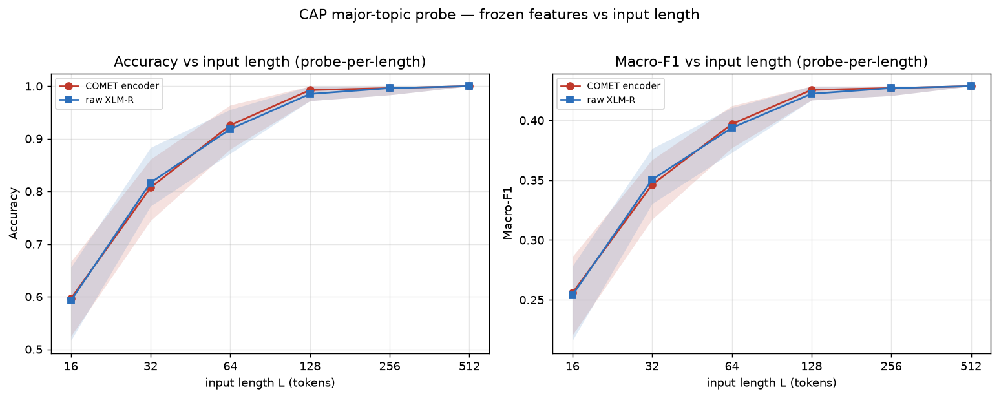
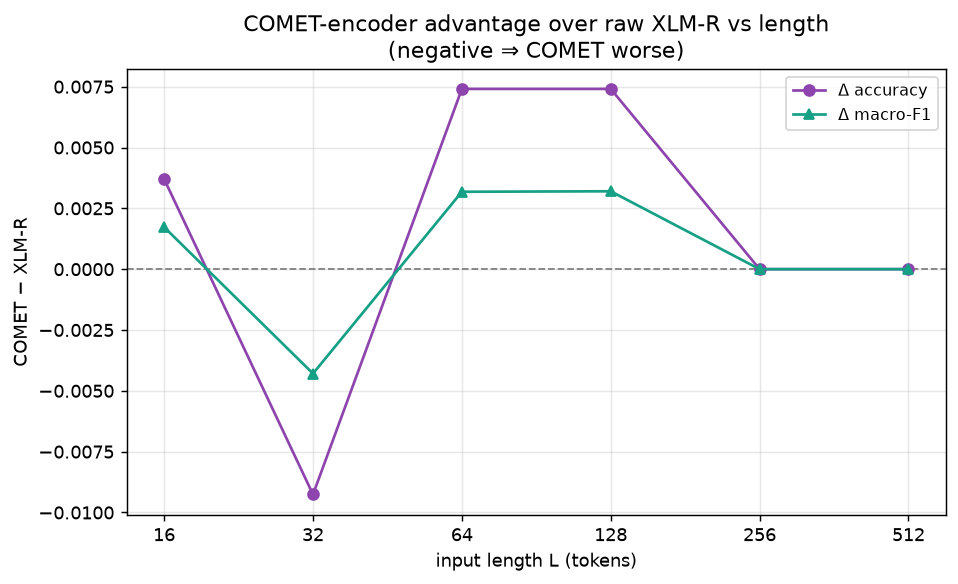

> ⚠️ **LOGIC-SMOKE ARTIFACT — NOT a scientific result.** Generated with the
> `mock` feature backend (fabricated, torch-free features) to validate the pipeline
> end-to-end. Numbers below are meaningless; rerun with `backend: hf` on the cluster.

# SUMMARY — Is the COMET encoder more length-sensitive than raw XLM-R?

**Task.** CAP major-topic classification (synthetic), 5 languages, 21 classes. Two frozen encoders sharing the XLM-R backbone — COMET (`Unbabel/wmt22-comet-da`, transformer extracted from the checkpoint) vs raw (`FacebookAI/xlm-roberta-large`) — probed with logistic regression on masked-mean features at token-prefix lengths [16, 32, 64, 128, 256, 512]. Paired design: the same ≥512-token documents feed every bucket, so length is the only thing that changes.

## Answer

On the accuracy-vs-length curve, the COMET encoder's slope on log₂(L) is **+0.0758** vs raw XLM-R's **+0.0755** accuracy per doubling of length. The COMET − XLM-R accuracy gap goes from **+0.0037** at L=16 to **+0.0000** at L=512 (Δ = -0.0037).

**Mixed.** Only part of the prediction holds (slope and gap-vs-length disagree); see tables.

## Key plots





## Length-sensitivity slopes (probe-per-length, lang=all)

| encoder | role | metric | slope_per_log2L | intercept | r2 | value_at_minL | value_at_maxL |
| --- | --- | --- | --- | --- | --- | --- | --- |
| comet-wmt22-comet-da-MOCK | comet | acc | 0.0758 | 0.3939 | 0.7835 | 0.5963 | 1.0000 |
| comet-wmt22-comet-da-MOCK | comet | macro_f1 | 0.0324 | 0.1692 | 0.7832 | 0.2557 | 0.4286 |
| xlmr-xlm-roberta-large-MOCK | raw | acc | 0.0755 | 0.3941 | 0.7859 | 0.5926 | 1.0000 |
| xlmr-xlm-roberta-large-MOCK | raw | macro_f1 | 0.0323 | 0.1694 | 0.7846 | 0.2540 | 0.4286 |

## COMET − XLM-R gap by length

| L | comet_acc | raw_acc | gap_acc | comet_f1 | raw_f1 | gap_f1 |
| --- | --- | --- | --- | --- | --- | --- |
| 16 | 0.5963 | 0.5926 | 0.0037 | 0.2557 | 0.2540 | 0.0017 |
| 32 | 0.8074 | 0.8167 | -0.0093 | 0.3463 | 0.3506 | -0.0043 |
| 64 | 0.9259 | 0.9185 | 0.0074 | 0.3969 | 0.3937 | 0.0032 |
| 128 | 0.9926 | 0.9852 | 0.0074 | 0.4254 | 0.4222 | 0.0032 |
| 256 | 0.9963 | 0.9963 | 0.0000 | 0.4270 | 0.4270 | 0.0000 |
| 512 | 1.0000 | 1.0000 | 0.0000 | 0.4286 | 0.4286 | 0.0000 |

## Reproduce

```bash
python run.py --config config.yaml          # full run (writes results.csv + all figures)
```

Tables: `results/results.csv`, `results/analysis/*.csv`. Figures: `results/figures/*.png`.